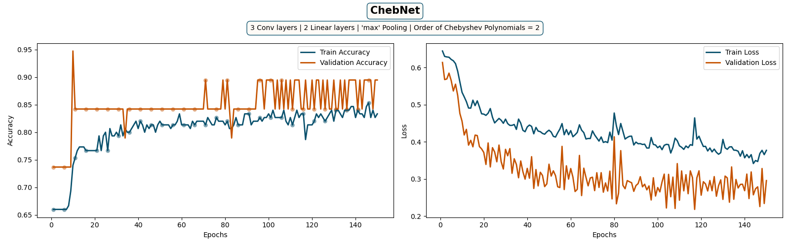

# Graph Classification

#### Authors
- **Tal Peer** tal.peer@campus.technion.ac.il
- **Matan Birenboim** matanb@campus.technion.ac.il
- **Tsuf Bechor** 

### Date
**November 2024**

### Papers
- Michaël Defferrard, Xavier Bresson, Pierre Vandergheynst  
  **Convolutional Neural Networks on Graphs with Fast Localized Spectral Filtering**   
  [arXiv:1606.09375](https://arxiv.org/abs/1606.09375)

- Gilmer, J., Schoenholz, S. S., Riley, P. F., Vinyals, O., & Dahl, G. E.  
  **Neural Message Passing for Quantum Chemistry**  
  [arXiv:1704.01212](https://arxiv.org/abs/1704.01212)

[ChebConv](https://pytorch-geometric.readthedocs.io/en/latest/generated/torch_geometric.nn.conv.ChebConv.html#torch_geometric.nn.conv.ChebConv) - PyG Documentation

